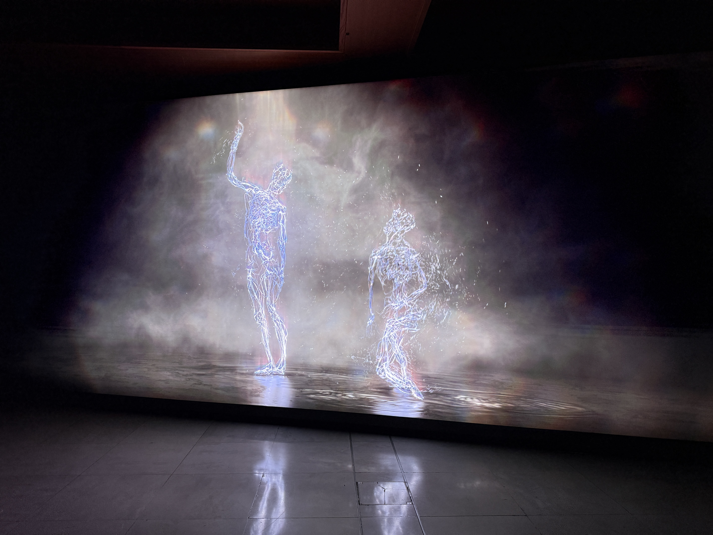

{fig-align="center" width="100%"}

Late last year, while hosting some visitors to London, I visited Ryoji Ikeda's data-cosm at 180 Studios on the Strand[^1]. The installation invites viewers to lie on the floor and experience an audio-visual sequence—data from all manner of sources transformed into light and sound, relentless and overwhelming. There were warnings about sensory overload at the entrance, and they weren't exaggerating. The experience was visceral, impressive, carrying the enigmatic flavour of *2001: A Space Odyssey*'s final sequence. But for all its intensity, it remained curiously disembodied—mathematical, algorithmic, abstract.

[^1]: https://www.180studios.com/data-cosm

After leaving, we walked past Somerset House, which was advertising the opening of Wayne McGregor's exhibition, *Infinite Bodies*[^2]. At the time, I had no idea who he was. But having just come off discussions about embodied cognition and artificial intelligence—and being in the market for another sightseeing stop—it seemed like serendipity. We ventured in.

[^2]: https://www.somersethouse.org.uk/press/wayne-mcgregor-infinite-bodies-new-installation-on-the-other-earth-further-exhibition-details

It proved the perfect foil to what came before. Where Ikeda's work visualizes data through abstraction—mapping information onto new planes, stripping away the human—McGregor's work does something quite different. British choreographer Wayne McGregor CBE, Resident Choreographer of The Royal Ballet and Artistic Director of Studio Wayne McGregor, is frequently described as a polymath. His collaborations span Radiohead, The Chemical Brothers, Jon Hopkins, and Max Richter, among many others. But what came across most strongly at the exhibition was his decidedly contemporary fixation on cognitive science—the relationship between body, time, and space. As he describes it, choreography is "a recursive conversation with our body's physical, emotional, and cognitive intelligence."

Where Ikeda is algorithmic, McGregor is embodied. Where Ikeda abstracts, McGregor inhabits.

# Physical Intelligence

The Infinite Bodies exhibition presents a collection of research-based works exploring the nature of physical intelligence and choreographic practice. McGregor—a veteran of studying alternative intelligences—uses these pieces to investigate how bodies contain, preserve, translate, and relate.

## Bodies as Vessels

Several works explore what the body holds and what persists when translated into other media.

In Omni, two dancers are captured and rendered digitally—a duet where bodies dissolve into each other and the environment, endlessly reforming. What survives this dissolution? The recognisable patterns of movement, the bodily intelligence that remains even when the flesh is stripped away.

{fig-align="center" width="80%"}

Future Self approaches the question differently: a grid of LED lights reflects and rearticulates the shapes and motions of bodies that surround it. Dancers see themselves reflected back—not as image, but as pattern. Movement translated into light.

Most striking are AISOMA and ATLAS. AISOMA is an AI model trained on McGregor's choreography—it detects poses from a live body in real time and suggests new phrases rooted in his choreographic language. ATLAS is a fully interactive digital map of McGregor's complete archive of performance work, allowing for remixing, superimposition, recognition. The body as archive: not just storing experience, but generating new possibilities from what it holds.

## Bodies in Relation

Other works explore how bodies exist in space and relate to others.

Audience consists of mirrors that shift to focus on you—tracking, following, watching. The piece evokes the emotional responses of being observed: the interplay between being viewed and being the viewer. Spatial awareness as a form of cognition.

This connects to what the exhibit calls "kinaesthetic empathy"—the embodied understanding of others through the language of the body. Our ability to relate to another's experience through perception and sensation. This relational capability is often instinctual, but we can become more conscious of it. The exhibit raises the possibility that such empathy might extend to machines.

Despite—or perhaps because of—the myriad ways we can characterise embodiment and intelligence, McGregor is acutely focused on process. Each artwork at the exhibit, each containing its own meditation on physical thinking, emerged from collaborations with dancers, artists, scientists, technologists. It's this collaborative exploration that seems most important to McGregor—the questioning work that precedes the final show. Exploration, interrogation, a constant reinterpretation and reinvention. Answers arrive stubbornly, irregularly, if at all.

His method seems to begin from skepticism, grasping for implausible concreteness, interpreting ideas through layers of iteration and experimentation. He seeks to connect disparate islands of research and speciality—always questioning, always asking "what if?"

It's a reminder that reasoning, finding answers, is itself a process. As the old line goes: "How do I know what I think until I see what I say?" For McGregor, the body is how we see what we think.

# Intelligence and substrate

The visit to McGregor's exhibition proved a timely reminder of the relationship between cognition and the substrate through which it's expressed. In a podcast released not two weeks before the exhibition opened, Andrej Karpathy—founding member of OpenAI and former director of AI at Tesla—spoke with Dwarkesh Patel[^3] about the evolution of intelligence and culture.

[^3]: https://youtu.be/lXUZvyajciY?si=\_wH9tTDjaDmkn19a

Asked whether, after twenty years of AI research, he's surprised that evolution spontaneously stumbled upon intelligence, Karpathy's answer was telling: *"The evolution of intelligence intuitively feels to me like it should be a fairly rare event."* And yet, as Patel points out, quoting Richard Sutton: once you get to a squirrel, you're most of the way to AGI. Squirrel-level intelligence appeared almost immediately after the Cambrian explosion—suggesting that once the substrate could support it, intelligence followed quickly.

But substrate isn't just about biological capability. It's about niche. Ravens are remarkably intelligent, but a bird with a bigger brain would fall out of the sky. Dolphins are clever, but as Karpathy notes, *"the universe of things you can do in water is probably lower than what you can do on land, just chemically."* No fire underwater. No tools. Humans found a niche that rewarded marginal increases in intelligence and had a body that could scale: hands for tools, land for chemistry, externalised digestion freeing energy for the brain.

The substrate shapes what kind of intelligence is possible.

Karpathy also highlights the role of adaptability. Intelligence, he argues, emerges when environments are unpredictable—when evolution can't bake solutions into the weights. *"You want these environments that change really rapidly, where you can’t foresee what will work well. You create intelligence to figure it out at test time."* Most animals are pre-baked. Humans have to figure it out after they're born.

And then there's culture—the scaffold that took us from modern cognitive architecture (perhaps 60,000 years ago) to agricultural revolution (10,000 years ago) to modernity. Intelligence alone wasn't enough; we needed a way to accumulate knowledge across generations. LLMs, Karpathy observes, don't yet have an equivalent. "Why can't an LLM write a book for other LLMs? Why can't other LLMs read this LLM's book and be inspired by it?" There's no culture yet—no accumulated, shared repertoire of knowledge built for and by the models themselves.

What McGregor makes visceral through art, Karpathy articulates through evolutionary history: intelligence is not substrate-independent. The body matters. The environment matters. The niche matters. Different substrates don't just carry different intelligences—they produce them.

# Outro

A few months after visiting the exhibition, I heard Wayne McGregor speak at the Royal Geographical Society in London, promoting his book *We Are Movement*. When asked what parents can do to help children appreciate intelligence wherever it manifests, his answer was simple: focus on curiosity and exploration. Asked about dealing with fear, he described his role as an artist as being "to explore, to seek, and not to know." He encouraged us to be more uncomfortable.

It struck me how closely this echoes Karpathy's account of why intelligence emerges at all. Intelligence, he argues, appears when environments are unpredictable—when you can't bake solutions into the system ahead of time. You need to figure it out at test time. The substrate matters, but so does the uncertainty. Intelligence isn't just shaped by constraints; it's called forth by them.

Ikeda's work demonstrates one kind of intelligence—the capacity to find pattern in noise, to render the chaotic legible. McGregor's work celebrates another—the body's intelligence, what it remembers, how it perceives and relates, what it produces through movement and collaboration. Both operate within constraints: data structures, biological vessels, the physics of light and limb.

Perhaps what unites them is that intelligence—whatever its substrate—seems to require a certain disposition toward the unknown. Not mastery, but inquiry. Not answers, but the willingness to dwell in questions. McGregor's collaborative process, his "what if?" methodology, mirrors the adaptive pressure Karpathy describes: environments that reward figuring it out rather than already knowing.

The substrate shapes what kind of intelligence is possible. But the orientation toward exploration—curiosity, discomfort, not-knowing—might be what makes intelligence actual.