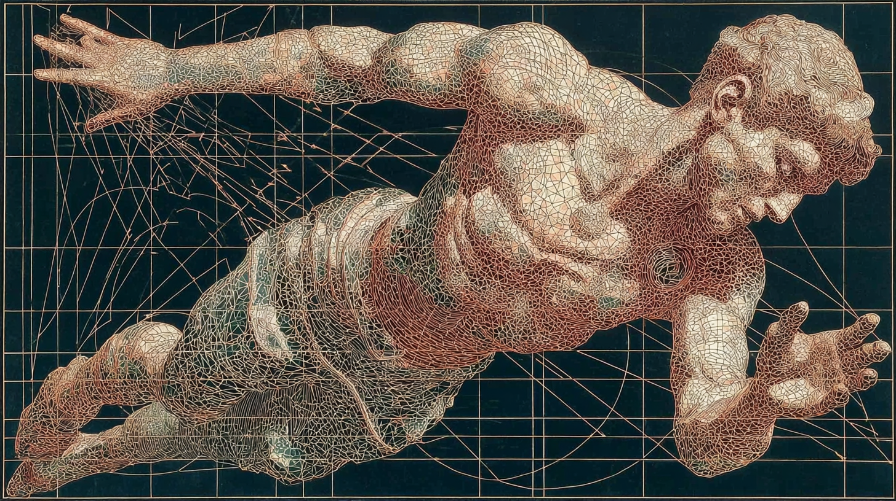

{fig-align="center" width="100%"}

A new form of embodied practice for me this year has been a weekly hip opener class. These classes contrast considerably with my other physical (embodied) practises in their pace and focus. For an hour, we focus on a limited set of joints/ muscles, dedicating all of our attention to these. Muscles are stretched, pushed, contracted, and sometimes all at once in the name of "Proprioceptive Neural Facilitation" - a practice which includes both contracting and pushing muscles at the limits of their extensions. It is extremely uncomfortable - this is the point. We reach the edge of our capabilities. Focus and attention are strictly limited to observing the shape of discomfort, conscious of edges, limits, preventing compensation and ultimately extending range and capability. 

Throughout all this there are various supports. Straps and blocks act as scaffolds, supporting balance and force where otherwise wouldn't be possible. Postures are set in opposition, compensatory behaviours brought to light. Meanwhile the teacher spends time adjusting each participant beyond the limits of their range. Already stretched limbs are pulled & manipulated further, beyond the realms of what's possible for one person to achieve on their own. All the while doing so in a manner safe, responsive, and extremely uncomfortable. 

Support exists in other forms, beyond equipment and teacher guidance. Take for instance the physical and social environments that make up the gym. Of course conveniences make it easier. Laundry washed and taken care of, one less thing to worry about. And post class saunas, the free hour that an early Monday morning session buys you. More than just relief for stretched muscles, the sauna ends up being a social scene with its own appeal. Similarly groggy gymgoers each rewarded, a social scene of its own providing additional motivation. What would your friends say if you didn't make it? What would you be missing out on? While a teacher might help extend our physical range, our behavioural range is supported by a wider variety of structures which nurture, encourage, and prod us in different ways.  

# Writing as practice

My recent uptick in writing has been due to two things:
- Greater speed to completion of single posts, and 
- better appreciation of post sequencing as a form of thought, prioritisation, and self-motivation. 
 
Recurrent ideas are completed or, if it is not their time, officially parked until it comes up again. But that appreciation for cadence, rhythm, have only come about as a result of a greater speed to completion. Higher volume of writing, written with a bias towards completion instead of perfection, allowing for better discernment, judgment, as well as intention. And where has this speed come from? It's come from the use of AI. Drafts are created, edited, talked about, and ultimately co-created with LLM tools that act, in some ways, as cognitive supports that help extend my capabilities beyond their current range. 

Perhaps I could have written more, myself, more frequently, if I had more self-discipline, organisation, and sense of direction, and more toughness about publishing incomplete and imperfect things, but the valuable thing is the cycle of completion, publishing, assessing, reorienting. How do we explore practise without theory, and theory without practise?

A recent [tweet](https://x.com/mer__edith/status/2018438544583196871?s=20) by Meredith Whittaker, CEO of Signal, highlights that the value and function of AI assisted writing isn't recognised as beneficial. As ever, the prevailing emotion is fear and concern.

> Writing is not just spewing pre-chewed thoughts onto a page. 
> 
> It’s a difficult process of getting clear about what you think by struggling to synthesize various ideas in language.
> 
> It’s hard, and most time “writing” is actually spent deleting and rephrasing and confronting the chasm of your own ignorance and coming back for more. It’s vulnerable. 
> 
> But if you stay with the difficulty and do so honestly, you will end up crafting a durable and unfuckwithable analysis that you can defend from every angle.
> 
> Outsource writing (and with it thinking) at your peril!

She's right about the difficulty of writing, sitting with discomfort, etc. She's not wrong that the act of writing and doing so yourself is valuable. She's also not alone in expressing these concerns. A number of papers out there express similar concern about the loss of capacities like critical thinking, or proliferation of superficial learning. A recent paper published in [Nature Reviews Bioengineering](https://www.nature.com/articles/s44222-025-00323-4)talks specifically about the value of writing and what might be lost through overreliance on AI systems:

> Writing compels us to think — not in the chaotic, non-linear way our minds typically wander, but in a structured, intentional manner. By writing it down, we can sort years of research, data and analysis into an actual story, thereby identifying our main message and the influence of our work. This is not merely a philosophical observation; it is backed by scientific evidence. 

In both of these cases, they highlight the virtues and advantages of writing. Their concern being that too much AI will undermine these and ultimately our ability to think. 

# Cognitive ergonomics of assisted cognitive extension

Where supported extensions in a hip opener class assist in the exploration and ultimately extension of range of motion, flexibility, and resilience, so too can AI assist in the exploration and extension of cognitive range. This is not to dismiss concerns that AI may undermine capabilities. It's likely true that unthinking, unreflective use of AI as a replacement for cognitive work will cause some degree of loss, atrophy. But the way AI tools are designed, and the way they are used, matters enormously. If we take a physical practice like hip openers as an example, the considered application of support may in fact build growth, flexibility, and resilience over time.

Clark and Chalmers' Extended Mind thesis[^1] paved the way for considering how the localised, biological mind is a node in a much vaster cognitive system — one made up of our environments, physical, social, and digital, and subject to far more complex information processing requirements than any single brain can handle alone.

In a 2015 paper on embedded and extended cognitive systems, Richard Heersmink[^2] describes a set of dimensions along which agents and artefacts become integrated. The question is not whether tools extend cognition — they do — but how tightly, and along what axes. He identifies eight:

- **Information flow** — how much information moves between agent and tool, and in which directions (one-way vs. continuous back-and-forth)
- **Reliability** — how consistently the tool performs its function
- **Durability** — how long-lasting the agent-tool relationship is (one-off vs. ongoing)
- **Trust** — the degree to which the agent relies on the tool's outputs without constant verification
- **Procedural transparency** — how easily the tool is used without conscious attention to its operation (a pen is transparent; a new software interface is not)
- **Informational transparency** — how easily the tool's representations are understood (familiar notation vs. opaque output)
- **Individualisation** — how tailored the tool is to the specific agent (generic vs. customised to your patterns)
- **Transformation** — the degree to which the tool changes the agent's cognitive capacities, and the agent reshapes the tool

The higher a system scores across these dimensions, the more deeply integrated it becomes — and the harder it is to draw a clean line between the person and the tool. This is what a hip opener class looks like when you've been going for months: the straps are extensions of your arms, the teacher's adjustments are anticipated, the environment is second nature. And it's what AI-assisted writing can look like when the practice is intentional: the tool becomes procedurally transparent, individualised to your thinking patterns, and the exchange is genuinely transformative in both directions — reshaping how you think, while being reshaped by how you use it.

Heersmink's dimensions give us something the current discourse lacks: a framework for evaluating not whether AI supports or undermines cognition, but *how well the integration is designed*. The question isn't "AI or no AI" — it's whether the cognitive ergonomics are good. Whether the support is distributed well, whether it extends without replacing, whether it leaves the agent more capable over time rather than less.

There is early evidence that this matters. A recent study on student interaction with ChatGPT[^3] found that engagement with AI — not mere knowledge of it, but active, reflective use — was associated with stronger performance on complex critical thinking tasks. The distinction is telling. Passive consumption atrophies. Active engagement, the kind where you stay present, modulate, choose, reject, reshape — that's the cognitive equivalent of sitting with discomfort long enough for change. But it has to be intentional, designed in a way that respects the cognition and agency of the user. 

Which brings us back to the mat. The hip opener class works not because the teacher does the stretching for you, but because the support is designed to keep you at the edge of your capacity, safely, for long enough that your range actually extends. The discomfort is the work. The scaffold makes the work possible. And it's the environment that holds the whole practice together.

These same design principles apply to cognitive extension. The question for AI-assisted writing, thinking, and learning is not whether to use support, but whether the support is well-designed: ergonomic, responsive, transparent, and oriented toward extending range, capacity, rather than substituting for it.

[^1]: Clark, A., & Chalmers, D. (1998). The Extended Mind. *Analysis*, 58(1), 7–19.
[^2]: Heersmink, R. (2015). Dimensions of Integration in Embedded and Extended Cognitive Systems. *Phenomenology and the Cognitive Sciences*, 14, 577–598.
[^3]: Ferrara, B. et al. (2024). Student interaction with ChatGPT can promote complex critical thinking skills. *Thinking Skills and Creativity*, 54.