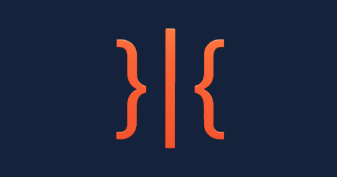

{fig-align="center" width="100%"}

Interface is a prototype cognitive augmentation software. It has been designed in light of recent developments in cognitive ergonomic theories relating to the idea that our minds are extended into the world outside and embodied in a variety of substrates. 

In addition, recently developed AI capabilities have been characterised as 'system 0', a distinct layer of the cognitive system which is tasked with performing inference - transforming, condensing, reformatting, linguistic content.  

Good cognitive design includes transparency, trust, clear and consistent inferential structures and knowledge flows. Good design supports, strengthens, and empowers.

Designed to encourage and enable privacy, self-sovereignty, options and comparability. An open system designed as the interface between your volition and your externalised cognitive structures. 

We create our tools and our tools reshape us and the world around us. 

- [Link](interface.app)